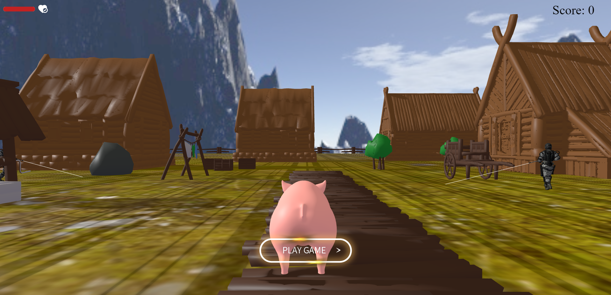
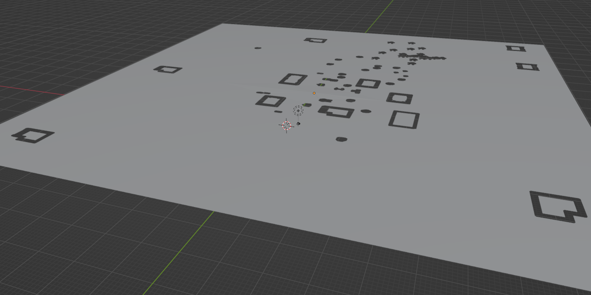
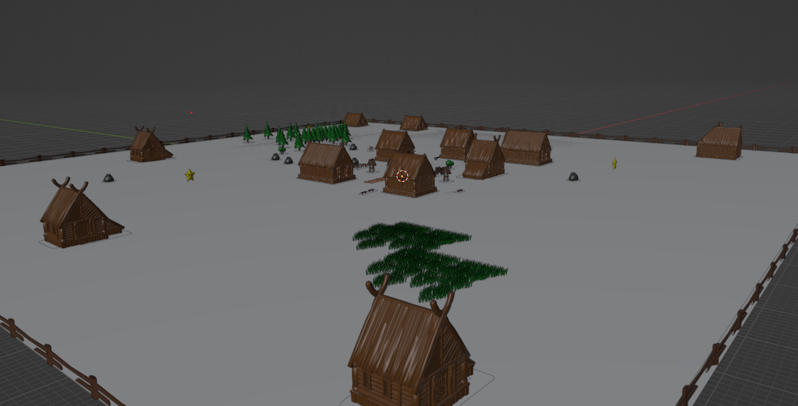

# Piggy the star collector

> Before I introduce you to the project, I would like to say that it was my school project made in early 2021, which means that my JavaScript knowledge at the time was not well structured and complete as it is right now.

In our game you can play as a pig whose main goal is to collect all the stars placed on the board.

How to play & Rules:
- Use W,A,S,D to control the pig,
- Hide behind objects from the army that will try to deprive you of your stars at all costs,
- Try to collect 5 stars and win the game!


Main features of the game:
- Sound ( music and ambient sounds ),
- Map made with Unity and Blender,
- Collision with the environment,
- Bots with path finding and shooting system.

Try it online! [Play](https://mateuszsuplewski.github.io/Piggy-Star-Collector/)


&nbsp;
 
## 💡 Technologies


&nbsp;
 
## 💿 Installation & Run

If you want to run the game locally on your computer, you will need a server.

The most popular and easiest way is to download the [Live Server](https://marketplace.visualstudio.com/items?itemName=ritwickdey.LiveServer) extension to your IDE.

After installation:
- Go to the `index.html` file,
- Right click on the code space,
- Select `Open with Live Server`.
- Enjoy the game.

&nbsp;
 
## 🤔 Solutions provided in the project

- ### Map model with Unity & Blender

In our solution, I used `Unity` to create a `navigation grid` representing a collision and resource download system with buildings and terrain.



I also used `Blender` to create the target model of the city.



 &nbsp;

- ### Sound effects
 Used `Three.AudioListener` to provide realistic sounds and enhance the gaming experience.
 ```javascript
  initSounds() {
    this.listener = new THREE.AudioListener();
    this.camera.add(this.listener);
    this.sfx = new SFX(
      this.camera,
      `${this.assetsPath}Load/sfx/`,
      this.listener
    );
    this.sfx.load("background_music", true, 0.1);
    this.sfx.load("game_end", true, 0.1);
    this.user.initSounds();
    this.npcHandler.npcs.forEach((npc) => npc.initSounds());
  }
```
 &nbsp;

- ### Collecting stars

To check if our character is close enough to collect a star, we used `THREE.Raycaster` that can check the distance between the map element and our character.

 
 ```javascript
const forward = this.forward
  .clone()
  .applyQuaternion(this.user.root.quaternion);

const pos = this.user.root.position
  .clone()
  .add(forward.multiplyScalar(this.speed * 0.167));

pos.y += 2;

this.raycaster.set(pos, this.forward);
const intersects3 = this.raycaster.intersectObjects(this.stars);

this.stars.forEach((star) => {
  let starPos = star.parent.position;
  if ( intersects3.length > 0 &&
    Math.abs(pos.x - starPos.x) < 1 &&
    Math.abs(pos.z - starPos.z) < 1 &&
    (star.parent.visible = true)
  ) {
    star.parent.visible = false;
    this.CollectedStar++;
  }
});
 ```
 &nbsp;
 
- ### Load models 

Realistic models that react to light and cast shadows are loaded with `THREE.GLTFLoader`.

 ```javascript
    loader.load(
      "pig2.glb",
      (gltf) => {
        this.root.add(gltf.scene);
        this.object = gltf.scene;
        this.object.frustumCulled = false;

        const scale = 1.2;
        this.object.scale.set(scale, scale, scale);

        this.object.traverse((child) => {
          if (child.isMesh) {
            child.castShadow = true;
            child.frustumCulled = false;
          }
        });

        this.ready = true;
        this.game.startRendering();
      },
      (err) => {
        console.error(err);
      }
    );
 ```

 As you can see Three.js is a powerfull library, if you want to check other solutions that were provided in the project, head into code.

 > This project is using several helpers that can be found in libs folder

 &nbsp;
 
&nbsp;

## 💭 Application development plans

What's the future of this game ?

I am fully satisfied with the effect I was able to achieve with the knowledge I had at that time.
I think that the game contains so many advanced mathematical elements that a simpler solution would be to create a new game with the newly acquired knowledge.

Currently, I can boast of knowing React and following in his footsteps, I came across a solution that can combine reusability and components from React with ThreeJS.

&nbsp;

## 🙋‍♂️ Feel free to contact me
In case you found any/more issues that could've been solved, you have ideas how we can create something more complex or just simply want to chat, then just let me know on:
[Linkedin](https://www.linkedin.com/in/mateusz-suplewski-705017227/) or via Email : Matx3582@gmail.com
&nbsp;

## 👏 Credits
Special thanks to [Nik Lever](https://github.com/NikLever) for his videos and github repositories which gave me a great knowledge of ThreeJS and showed the power of this library.


&nbsp;